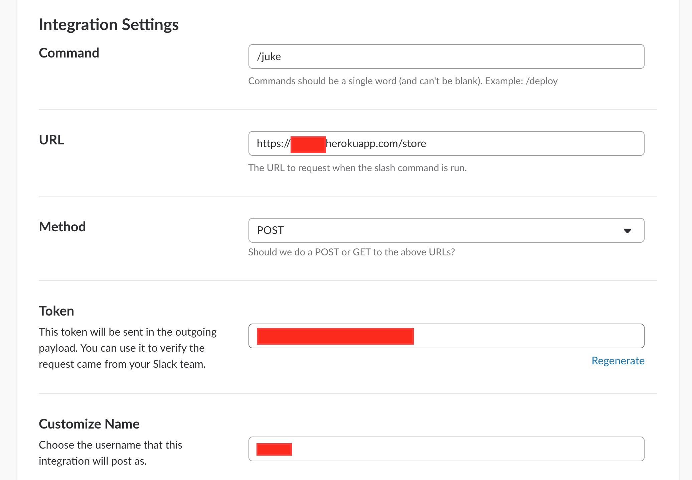
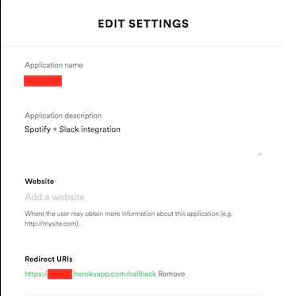
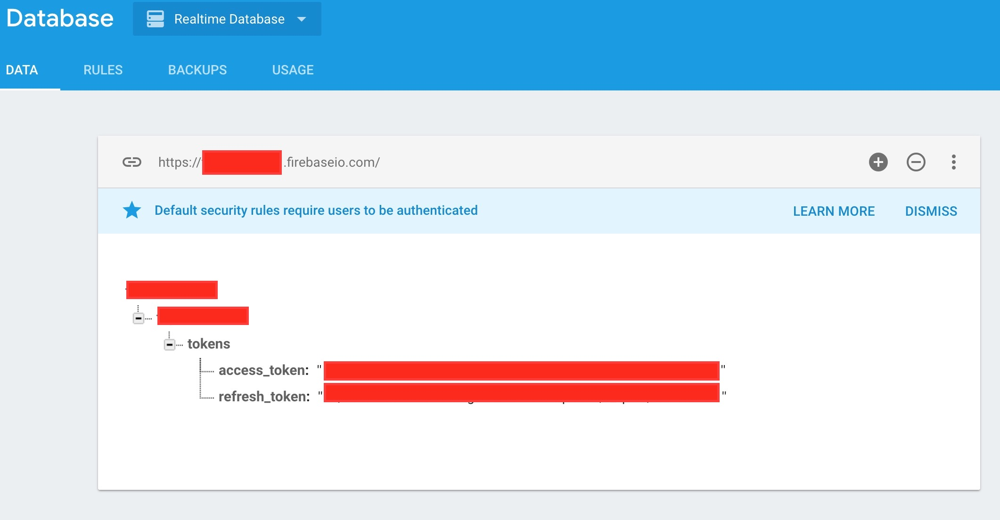

# Slack Jukebox
Add music to a Spotify playlist through a Slack command.

Simply create a Slash Command, such as `/juke`, which accepts a track name (also the artist too for a less fuzzy search) to add to a pre-defined Spotify playlist:

    /juke Ramble On – Led Zeppelin
    /juke Ramble On
    

## Installation

### Slack Slash command

First you'll want to create your Slack Slash Command, which you can do by going to your [Slash Commands page](https://my.slack.com/services/new/bots).

During setup, have your slash command or outgoing webhook submit a POST to your app's `/store` endpoint, e.g. `https://app-name.herokuapp.com/store`.

Make a note of the `token`, as you'll need it later to help guard against cross-site request forgery.

### Slack bot to post messages

You can post to a channel the songs you are adding to the playlist or decide not to, it all depends on the enviroment variables you add.
If you want to post the song that was recently added, go to [Your Slack's app directory](https://my.slack.com/apps/manage/custom-integrations) and just create a simple bot and give it a name. Make note of the `token` of the bot, you will need it later.

### Spotify

Head over to [Spotify's Developer Site](http://developer.spotify.com) and create a new Application. Make sure you add whatever slackbox's callback URI as a valid callback URI. If you're running locally, this will be `http://localhost:5000/callback` or on Heroku `https://app-name.herokuapp.com/callback`

Make a note of the `key`, `secret` and `callback URI` too, as you'll need these later as well.

Create a public playlist on Spotify. You can make it public by clicking on the `...` (options) and click on `Make public`. Then, to copy the playlist URI, click again on `...`, `share`, `Copy Spotify URI`. You will only need the last segment of the URI like: spotify:user:dracocraco10:playlist:`6Y0NY8dbLCrRcfIRyn3AdM`.

### Keeping your app alive forever

If you create an app on Heroku for free, the app will go to sleep after 30 minutes. To get around this, you can use [Firebase](https://console.firebase.google.com/) to host your authorization tokens and a [Cron Job](https://cron-job.org/en/) that runs every 30 minutes to hit your `/refresh` endpoint and refreshes your access tokens. This way you make sure your app will run forever.

#### Firebase

To create a Firebase database, create an account for free, add project with same name as on Heroku, create a database, and then generate a private key to get your `Firebase service account key` JSON file. You will need this file in the root of your project as it contains the private key to your DB.

#### Cron job

Set up your cron job that will hit your app's `/refresh` endpoint every 30 minutes to keep your project awake.

### Heroku

You can use any service to host your app, I personally used [Heroku](https://www.heroku.com/). If you decide to use Heroku, create an app for free, deploy your local copy of the Slack jukebox and set up the *environment variables*. You can either do this with an `.env` file or in the `Config Variables` section in Settings:

* `APP_AUTHORIZE_ENDPOINT` - URL TO `/authorize` endpoint (e.g.: https://project.herokuapp.com/authorize)
* `FIREBASE_DATABASE_NAME` - Your Firebase DB's name (e.g.: project-1j243).
* `FIREBASE_SERVICE_ACCOUNT_KEY` - Path to your Firebase Service Account JSON file.
* `SLACK_CHANNEL` - Name of the Slack channel where the songs added to the playlist will post.
* `SLACK_EMOJI_ICON` - Emoji for the message posting on the channel.
* `SLACK_TOKEN` - The token from Slack's Slash Command.
* `SLACK_TOKEN_BOT` - The token from Slack's bot.
* `SLACK_USERNAME` - The username of the bot that posts to the channel.
* `SPOTIFY_KEY` - Your Spotify application key (a.k.a Client ID).
* `SPOTIFY_PLAYLIST_ID` - Your playlist identifier.
* `SPOTIFY_REDIRECT_URI` - URI to redirect to once your user has allowed the application's permissions.
* `SPOTIFY_SECRET` - Your Spotify application secret (a.k.a Client Secret).
* `SPOTIFY_USERNAME` - Your Spotify username.

### Authentication

Visit your `APP_AUTHORIZE_ENDPOINT` to authenticate yourself with Spotify and you should be all set!
